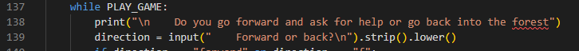
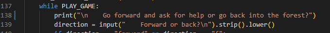
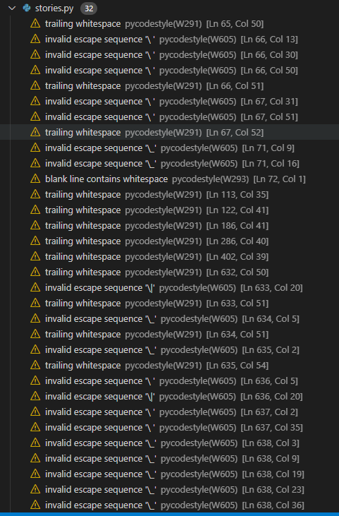

# Choose your Adventure

The Woods is a Choose your Adventure / Interactive Story style game.

The live link can be found here - https://choose-your-adventure-pp3.herokuapp.com/

## UX 

### Project Goals

### User Stories

### Design

Below you will find flow chart that maps out all the entire flow of the programme and shows all the different winding decisions.

## Features 

### Existing Features

### Future Features

## Technology Used

# Testing 

## Manual Testing

## Validator Testing 

Code Institue recomended using the PEP8 Python Validator to to validate the code written for this project.

This site is no longer active so the below steps were taken to validate the code for this project.

A PEP8 validator was added to my Gitpod Workspace by following these steps.

1. Run the command pip3 install pycodestyle  Note that this extension may already be installed, in which case this command will do nothing.
2. In your workspace, press Ctrl+Shift+P (or Cmd+Shift+P on Mac).
3. Type the word linter into the search bar that appears, and click on Python: Select Linter from the filtered results.
4. Select pycodestyle from the list.
5. PEP8 errors will now be underlined in red, as well as being listed in the PROBLEMS tab beside your terminal.

See below images of problems found after installing the above PEP8 workaround.

Problems for run.py

- Problem on Ln 269 - line is too long. This is because of .strip().lower()
    Will to accept this problem
- Problem on Ln 70 line is too long. This is because of .strip().lower()
    Will to accept this problem
- Problem on Ln138. Line is too long. To fix this i re worded the print statement.
    See below images to support.

Problems for stories.py

Will to accept all warnings because they are shown because of th ASCII art used.

## Lighthouse Testing

## Bugs

# Deployment

## How this Project was Deployed

## Cloning the repository

## Manually Downloading the Repository

## Opening the Repository

# Credits 

### Media

