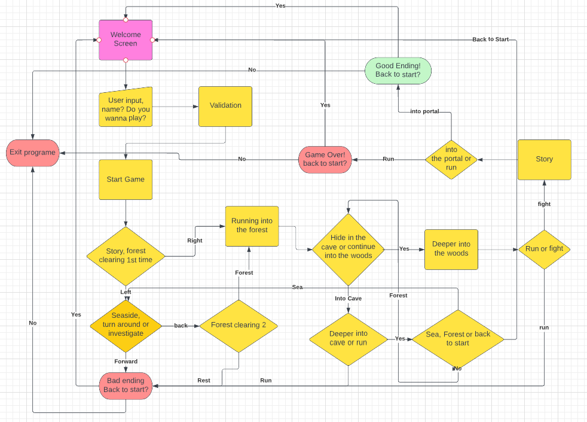
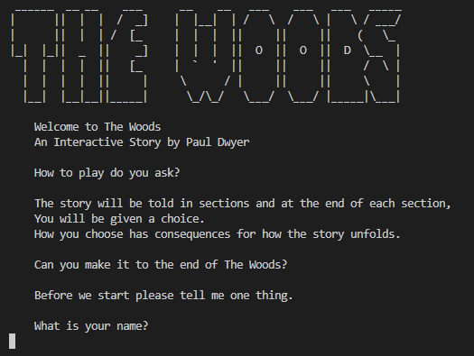
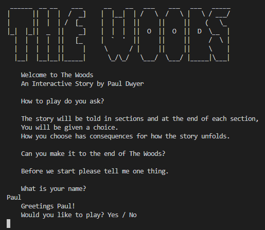
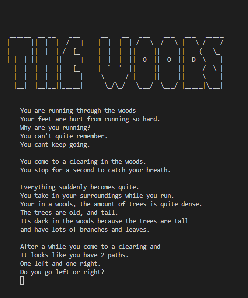
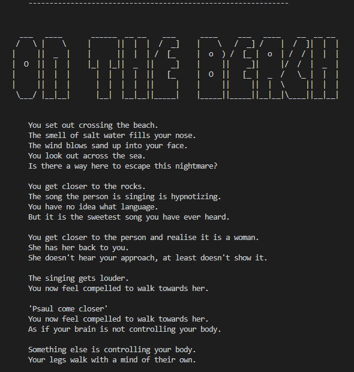
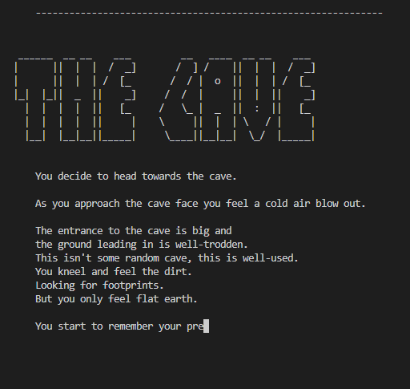
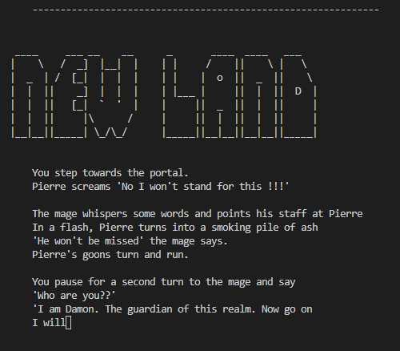
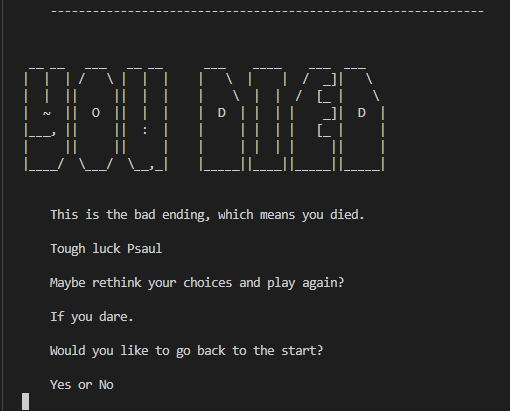
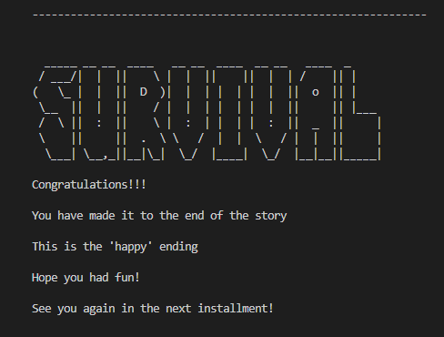

# The Woods

The Woods is a Choose your Adventure / Interactive Story style game.

The story begins with an introduction and the user is asked their name and if they want to play.

The game starts and the user is told a story and given a choice at the end of the story section.

Depending on the choice the user makes the story branches off into different paths with many different results.

The live link can be found here - https://choose-your-adventure-pp3.herokuapp.com/

## UX 

### Project Goals

The scope of the project was to build a command line application that allows users to manage a common dataset about a particular domain.

### User Stories

As a First time User

- I want to easily understand the main purpose of the site and the application.
- I want to have an easy and obvious way to make choices
- I want to experience and interesting story so that I can have some fun.
- I want the writing to set the scene and draw me into the story and world
- I want the option to try again once the game is completed.

As a Returning user

- I want to have multiple ways the story can send so i can experience them all.
- I want to feel the different choices to be interesting and not repetitive.

As a Site Owner 

- I want to provide users with an enjoyable story.
- I want the story to be immersive so users will return to try other choices.
- I want the story to be replayable and fun.

### Design

Below you will find flow chart that maps out all the entire flow of the programme and shows all the different winding decisions.

## Features 

In this section I will talk about the features of the site.

### Existing Features

- Intro Page
    - When the application loads up you are brought to the intro page.
    - The intro page shows the title art.
    - Welcomes the user and tell the user this is a interactive story and the author.
    - Tells the user how to play
    - Asks the user their name (this will be used throughout the story)
    - After the user enters their name they are welcomed by name and asked do they want to play.

- Story
    - The story starts and the user gets a little bit of the story.
    - The story is descriptive to try immerse the user in the story.
    - Title art is show at the top of the page. This changes depending on location in the story.
    - At the end of this story section the user is given a choice. Go left or right.
    - The story is myseterious on purpose, the user gets breadcrumbs of the back story 
    throughout the different routes the user can take. This is encourage the user to replay to learn 
    the whole story.

- End Screen
    - There is 2 different end screens that the user can experience.
    - The "You Died" screen and the "Survival" Screen.
    - The bad ending is when the user dies. The user is given a message and asked do they
    want to play again
    - The good ending is when the user survives and makes it to the end of the game.
    The user is given a message and asked do they want to play again.

### Future Features

- Create a function that allows skipping the typed effect with a button press.
- Build out the story world more.
- Add more routes and decisions.
- Make a fighting mechanic.

## Languages Used

- [Python](https://www.python.org/downloads/release/python-3811/) - Built using Python Language.

## Frameworks, Libaries and Programmes used

- [GitPod](https://gitpod.io/) - Site was developed using GitPod in broswer IDE.

- [GitHub](https://github.com/) - Repository and version control was hosted with GitHub.

- [Sys](https://docs.python.org/3/library/sys.html) - Used for slow typing effect.

- [OS](https://docs.python.org/3/library/os.html) - Used for the clear function.

- [Time](https://docs.python.org/3/library/time.html) - Used for the slow typing effect.

- [Heroku](https://dashboard.heroku.com/login) - Site deployed on Heroku.

- [Lucid Charts](https://www.lucidchart.com/) - Used for project planning.

# Testing 

For all testing please refere to [Teesting.md](testing.md)

# Deployment

This project was developed using Code Institue's mock terminal for Heroku.

## How this Project was Deployed

This project was developed in GitPod.

The repository was hosted on GitHub and was created using Code Institutes template.

The project was deployed on Heroku using the following steps.

1. Create or log in to your account at heroku.com.

2. Create a new app, add a unique app name and then choose your region.

3. Click on create app.

4. Go to "Settings" and go to under Config Vars store any sensitive data you saved in .json file. Name 'Key' field, copy the .json file and paste it to 'Value' field. Also add a key 'PORT' and value '8000'.

5. Add required buildpacks (further dependencies). For this project, set it up so Python will be on top and Node.js on bottom

6. Go to "Deploy" and select "GitHub" in "Deployment method"

7. To connect Heroku app to your Github repository code enter your repository name, click 'Search' and then 'Connect' when it shows.

8. Choose branch to build from.

9. If prefered, click on "Enable Automatic Deploys", which keeps the app up to date with your GitHub repository. Wait for the app to build.

10. Once ready you will see the “App was successfully deployed” message and a 'View' button to take you to your deployed link.

## Cloning the repository

1. Visit Choose-your-adventure respository. https://github.com/Pauldwyer/Choose-your-adventure

2. Click the "Code" dropdown box above the repository's file explorer.

3. Under the "Clone" heading, click the "HTTPS" sub-heading.

4. Click the clipboard icon, or manually copy the text presented: https://github.com/Pauldwyer/Choose-your-adventure.git

5. Open your preferred IDE.

4. Ensure your IDE has support for Git or has the relevant Git extension.

7. Open the terminal, and create a directory where you would like the Repository to be stored.

8. Type git clone and paste the previously copied text (https://github.com/Pauldwyer/Choose-your-adventure.git) and press enter.

9. The repository will then be cloned into your selected directory.

## Manually Downloading the Repository

1. Visit [Choose Your Adventure](https://github.com/Pauldwyer/Choose-your-adventure) respository.

2. Click the "Code" dropdown box above the repository's file explorer.

3. Click the "Download Zip" option; this will download a copy of the selected branch's repository as a zip file.

4. Locate the ZIP file downloaded to your computer, and extract the ZIP to a designated folder in which you would like the repository to be stored.

## Opening the Repository

1. Open your preferred IDE.

2. Navigate to the chosen directory where the Repository was cloned/extracted.

3. You will now have offline access to the contents of the project.

# Credits 

[ASCII Art](https://patorjk.com/software/taag/#p=display&h=3&f=Crawford2&t=deeper%0Ainto%20%0Athe%20forest) - A site that converts text to ASCII art. This was used for all art in the project.

