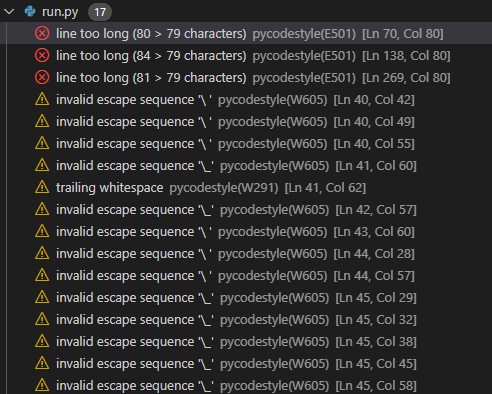

# The Woods

The Woods is a Choose your Adventure / Interactive Story style game.

The story begins with an introduction and the user is asked their name and if they want to play.

The game starts and the user is told a story and given a choice at the end of the story section.

Depending on the choice the user makes the story branches off into different paths with many different results.

The live link can be found here - https://choose-your-adventure-pp3.herokuapp.com/

## UX 

### Project Goals

### User Stories

### Design

Below you will find flow chart that maps out all the entire flow of the programme and shows all the different winding decisions.

## Features 

In this section I will talk about the features of the site.

### Existing Features

### Future Features

- 

## Technology Used

- [GitPod](https://gitpod.io/) - Site was developed using GitPod in broswer IDE.

- [GitHub](https://github.com/) - Repository and version control was hosted with GitHub

# Testing 

## Manual Testing

| Type of Test | Steps | Expected Results | Results
|--------------|-------|------------------|---------
| Name Input Test | Open deployed site https://choose-your-adventure-pp3.herokuapp.com/    |   Directs to Terminal in webpage               | Working as intended     
|              | Enter Name with numbers | Input error name cant contain numbers please try again | Working as intended |
|              | Enter Name with symbols | Input error name cant contain symbols please try again | Working as intedned |
|        | Enter name longer than 20 letters | Input error username is too long try again | Working as intended |
|        | Dont enter any name and press enter | Input error username too short try again | Working as inteded |
|        | Enter normal name with no symbols or numbers 4 letters long | Ask do you want to play a game? | Working as intended |

| Type of Test | Steps | Expected Results | Results |
| -------------|-------|------------------|---------|
|Do you want to play User Input | Open deploted site | Directs to Terminal in webpage | Working as intended
| | Enter name correctly | Accepts name and welcomes user by name | Working as intended |
| | User is asked do they want to play? Yes/No | |
| | User types numbers | Input error please try again | Working as intended |
| | User types symbols | Input error please try again | Working as intedned |
| | User dosent type, only pressed Enter | Input error please try again | Working as intended |
| | User types Yes or Y | Game starts | Working as intended |
| | User types No or N | User is asked do they want to go back to the start | Working as intended |

## Validator Testing 

Code Institue recomended using the PEP8 Python Validator to to validate the code written for this project.

This site is no longer active so the below steps were taken to validate the code for this project.

A PEP8 validator was added to my Gitpod Workspace by following these steps.

1. Run the command pip3 install pycodestyle  Note that this extension may already be installed, in which case this command will do nothing.
2. In your workspace, press Ctrl+Shift+P (or Cmd+Shift+P on Mac).
3. Type the word linter into the search bar that appears, and click on Python: Select Linter from the filtered results.
4. Select pycodestyle from the list.
5. PEP8 errors will now be underlined in red, as well as being listed in the PROBLEMS tab beside your terminal.

See below images of problems found after installing the above PEP8 workaround.

#### Problems for run.py

- Problem on Ln 269 - line is too long. This is because of .strip().lower()
    Will to accept this problem
- Problem on Ln 70 line is too long. This is because of .strip().lower()
    Will to accept this problem
- Problem on Ln138. Line is too long. To fix this i re worded the print statement.
    See below images to support.

#### Problems for stories.py

Will to accept all warnings because they are shown because of th ASCII art used.

## Lighthouse Testing

## Bugs

- First bug I encountered was when I started using while loops for validation.
    I didnt have any breaks in the loops so they kept running when they shouldnt of been.
    To fix this I used break to break the while loops after receiving a valid input from the user.

# Deployment

This project was developed using Code Institue's mock terminal for Heroku.

## How this Project was Deployed

This project was developed in GitPod.

The repository was hosted on GitHub and was created using Code Institutes template.

The project was deployed on Heroku using the following steps.

1. Create or log in to your account at heroku.com.

2. Create a new app, add a unique app name and then choose your region.

3. Click on create app.

4. Go to "Settings" and go to under Config Vars store any sensitive data you saved in .json file. Name 'Key' field, copy the .json file and paste it to 'Value' field. Also add a key 'PORT' and value '8000'.

5. Add required buildpacks (further dependencies). For this project, set it up so Python will be on top and Node.js on bottom

6. Go to "Deploy" and select "GitHub" in "Deployment method"

7. To connect Heroku app to your Github repository code enter your repository name, click 'Search' and then 'Connect' when it shows.

8. Choose branch to build from.

9. If prefered, click on "Enable Automatic Deploys", which keeps the app up to date with your GitHub repository. Wait for the app to build.

10. Once ready you will see the “App was successfully deployed” message and a 'View' button to take you to your deployed link.

## Cloning the repository

1. Visit Choose-your-adventure respository. https://github.com/Pauldwyer/Choose-your-adventure

2. Click the "Code" dropdown box above the repository's file explorer.

3. Under the "Clone" heading, click the "HTTPS" sub-heading.

4. Click the clipboard icon, or manually copy the text presented: https://github.com/Pauldwyer/Choose-your-adventure.git

5. Open your preferred IDE.

4. Ensure your IDE has support for Git or has the relevant Git extension.

7. Open the terminal, and create a directory where you would like the Repository to be stored.

8. Type git clone and paste the previously copied text (https://github.com/Pauldwyer/Choose-your-adventure.git) and press enter.

9. The repository will then be cloned into your selected directory.

## Manually Downloading the Repository

1. Visit [Choose Your Adventure](https://github.com/Pauldwyer/Choose-your-adventure) respository.

2. Click the "Code" dropdown box above the repository's file explorer.

3. Click the "Download Zip" option; this will download a copy of the selected branch's repository as a zip file.

4. Locate the ZIP file downloaded to your computer, and extract the ZIP to a designated folder in which you would like the repository to be stored.

## Opening the Repository

1. Open your preferred IDE.

2. Navigate to the chosen directory where the Repository was cloned/extracted.

3. You will now have offline access to the contents of the project.

# Credits 

[ASCII Art](https://patorjk.com/software/taag/#p=display&h=3&f=Crawford2&t=deeper%0Ainto%20%0Athe%20forest) - A site that converts text to ASCII art. This was used for all art in the project.

### Media

